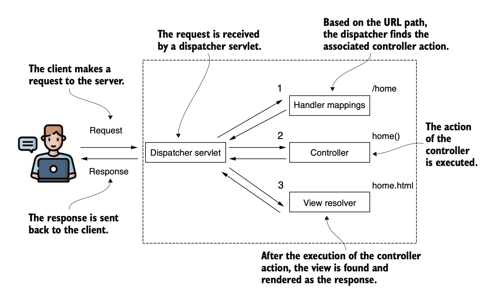

# <font size="6p">spring-security-6-samples</font> <font size="5p">  | [English](README.md)</font>

<p align="left">
 <a href="https://github.com/chensoul/spring-security-6-samples/actions/workflows/maven.yml"></a>
 <a href="/pom.xml"></a>
 <a href="/pom.xml"></a>
	<a href="https://github.com/chensoul/spring-security-6-samples/network/members"></a>
	<a href="https://github.com/chensoul/spring-security-6-samples/watchers"></a>
	<a href="https://github.com/chensoul/spring-security-6-samples/issues"></a>
	<a href="https://github.com/chensoul/spring-security-6-samples/blob/main/LICENSE"></a>
</p>

基于 Maven 构建的 Spring Security 6 示例。

## 说明

### 流程图

Spring Security 流程图


Spring MVC 流程图



### FormLogin


### Http Basic


### PasswordEncoder 和 UserDetailsService

PasswordEncoder 通常和 UserDetailsService 一起配置，配置 UserDetailsService 时，需要指定 PasswordEncoder。

### HttpSecurity

配置 Spring Security 有两种方式：

- 继承 WebSecurityConfigurerAdapter 类（在 Spring Security
  5.7.0-M2之后已删除，参考[文档](https://spring.io/blog/2022/02/21/spring-security-without-the-websecurityconfigureradapter)）
- 使用 @Bean 注解装配 Bean。不建议混合使用两种方式，推荐使用第二种方式。

### OAuth2

OAuth2 Token 有两种格式：

- Opaque，不透明。不存储数据的令牌。要实现授权，资源服务器通常需要调用授权服务器，提供不透明的令牌，并获取详细信息。
- No Opaque，非不透明，存储数据的令牌，使后端能够立即实现授权。JWT 是最常用的非不透明令牌实现。

- OAuth2 漏洞：
    - CSRF
    - Stealing client credentials
    - 重放令牌
    - 令牌劫持，参考[文档](https://blog.intothesymmetry.com/2015/06/on-oauth-token-hijacks-for-fun-and.html)

### Testing

#### 使用模拟用户

1. `@WithMockUser`

   ```java
     //Using @WithMockUser to define a mock user		
     @Test
      @WithMockUser
     public void helloAuthenticated() throws Exception {
         mvc.perform(get("/hello"))
                 .andExpect(content().string("Hello, user!"))
                 .andExpect(status().isOk());
     }
   
     //Using a RequestPostProcessor to define a mock user
     @Test
      public void helloAuthenticatedWithUser() throws Exception {
         mvc.perform(get("/hello")
                         .with(user("mary")))
                 .andExpect(content().string("Hello, mary!"))
                 .andExpect(status().isOk());
     }
   ```

2. `@WithUserDetails`。通过 `UserDetailsService` 模拟用户

   ```java
     @Test
      @WithUserDetails("user")
     public void helloAuthenticated() throws Exception {
         mvc.perform(get("/hello"))
                 .andExpect(status().isOk());
     }
   ```

3. 自定义注解 `@WithCustomUser`
   ：示例 [seco-ch1-oauth2client-ex1](seco-ch1-oauth2client-ex1/src/test/java/com/chensoul/security/config/WithCustomUser.java)

#### 测试 Method

```java

@SpringBootTest
class MainTests {

    @Autowired
    private NameService nameService;

    @Test
                "it throws AuthenticationException")

    void testNameServiceWithNoUser() {
        assertThrows(AuthenticationException.class,
                () -> nameService.getName());
    }

    @Test
    @WithMockUser(authorities = "read")
                "it throws AccessDeniedException")

    void testNameServiceWithUserButWrongAuthority() {
        assertThrows(AccessDeniedException.class,
                () -> nameService.getName());
    }

    @Test
    @WithMockUser(authorities = "write")
                "it returns the expected result")

    void testNameServiceWithUserButCorrectAuthority() {
        var result = nameService.getName();

        assertEquals("Fantastico", result);
    }
}
```

#### 测试 Authentication

1. 测试 `httpBasic()`

示例：sec-ch2-user-ex1-memory

```java

@SpringBootTest
@AutoConfigureMockMvc
public class MainTests {
    @Autowired
    private MockMvc mvc;

    @Test
    public void helloAuthenticatingWithValidUser() throws Exception {
        mvc.perform(get("/hello")
                        .with(httpBasic("user", "password")))
                .andExpect(status().isOk());
    }
}
```

2. 测试 `formLogin()`

示例：sec-ch4-authn-ex6-handler

```java

@SpringBootTest
@AutoConfigureMockMvc
public class MainTests {

    @Autowired
    private MockMvc mvc;

    @Test
    public void loggingInWithWrongUser() throws Exception {
        mvc.perform(formLogin()
                        .user("joey").password("password"))
                .andExpect(header().exists("failed"))
                .andExpect(unauthenticated());
    }

    @Test
    public void loggingInWithWrongAuthority() throws Exception {
        mvc.perform(formLogin()
                        .user("mary").password("password")
                )
                .andExpect(redirectedUrl("/error"))
                .andExpect(status().isFound())
                .andExpect(authenticated());
    }

    @Test
    public void loggingInWithCorrectAuthority() throws Exception {
        mvc.perform(formLogin()
                        .user("bill").password("password")
                )
                .andExpect(redirectedUrl("/home"))
                .andExpect(status().isFound())
                .andExpect(authenticated());
    }

}
```

3. 使用模拟 JWT 测试资源服务器

```java

@SpringBootTest
@AutoConfigureMockMvc
class ApplicationTests {
    @Autowired
    private MockMvc mockMvc;

    @Test
    void demoEndpointSuccessfulAuthenticationTest() throws Exception {
        mockMvc.perform(
                        get("/demo").with(jwt()))
                .andExpect(status().isOk());
    }
}
```

4. 使用模拟 Opaque Token 测试资源服务器

```java

@SpringBootTest
@AutoConfigureMockMvc
class ApplicationTests {
    @Autowired
    private MockMvc mockMvc;

    @Test
    void demoEndpointSuccessfulAuthenticationTest() throws Exception {
        mockMvc.perform(
                        get("/demo").with(opaqueToken()))
                .andExpect(status().isOk());
    }
}
```

#### 测试 CSRF

示例：sec-ch3-httpSecurity-ex2-csrf

```java

@SpringBootTest
@AutoConfigureMockMvc
public class MainTests {

    @Autowired
    private MockMvc mvc;

    @Test
    public void testHelloPOST() throws Exception {
        mvc.perform(post("/hello"))
                .andExpect(status().isForbidden());
    }

    @Test
    public void testHelloPOSTWithCSRF() throws Exception {
        mvc.perform(post("/hello")
                        .with(httpBasic("user", "password")).with(csrf()))
                .andExpect(status().isOk());
    }
}
```

#### 测试 CORS

示例：sec-ch3-httpSecurity-ex3-cors

```java

@SpringBootTest
@AutoConfigureMockMvc
public class MainTests {

    @Autowired
    private MockMvc mvc;

    @Test
    public void testCORSForTestEndpoint() throws Exception {
        mvc.perform(options("/hello")
                        .header("Access-Control-Request-Method", "POST")
                        .header("Origin", "http://www.example.com")
                ).andExpect(header().exists("Access-Control-Allow-Origin"))
                .andExpect(header().string("Access-Control-Allow-Origin", "*"))
                .andExpect(header().exists("Access-Control-Allow-Methods"))
                .andExpect(header().string("Access-Control-Allow-Methods", "POST"))
                .andExpect(status().isOk());
    }

}
```

#### 测试认证服务器

1. 密码模式

示例：seco-ch2-authServer-ex1

```java

@SpringBootTest
@AutoConfigureMockMvc
public class MainTests {

    @Autowired
    private MockMvc mvc;

    @Test
    public void testAccessTokenIsObtainedUsingValidUserAndClient() throws Exception {
        mvc.perform(
                        post("/oauth/token")
                                .with(httpBasic("client", "secret"))
                                .queryParam("grant_type", "password")
                                .queryParam("username", "user")
                                .queryParam("password", "password")
                                .queryParam("scope", "read")
                )
                .andExpect(jsonPath("$.access_token").exists())
                .andExpect(status().isOk());
    }
}
```

2. 授权码模式

示例：seco-ch2-authServer-ex2

```java

@SpringBootTest
@AutoConfigureMockMvc
public class MainTests {

    @Autowired
    private MockMvc mvc;

    @Test
    public void testAuthorizeEndpoint() throws Exception {
        mvc.perform(get("/oauth/authorize")
                        .queryParam("response_type", "code")
                        .queryParam("client_id", "client")
                        .queryParam("scope", "read")
                )
                .andExpect(redirectedUrl("http://localhost/login"))
                .andExpect(status().isFound());
    }

}
```

3. 客户端凭证模式

示例：seco-ch2-authServer-ex3

```java

@SpringBootTest
@AutoConfigureMockMvc
public class MainTests {

    @Autowired
    private MockMvc mvc;

    @Test
    public void testAccessTokenIsObtainedUsingValidClientCredentials() throws Exception {
        mvc.perform(
                        post("/oauth/token")
                                .with(httpBasic("client", "secret"))
                                .queryParam("grant_type", "client_credentials")
                                .queryParam("scope", "info")
                )
                .andExpect(jsonPath("$.access_token").exists())
                .andExpect(status().isOk());
    }
}
```

## TODO

- MFA

## 其他

### 生成 HTTPS 证书

生成字签名证书：

```bash
openssl req -newkey rsa:2048 -x509 -keyout key.pem -out cert.pem -days 365
# 输入密码为123456

openssl pkcs12 -export -in cert.pem -inkey key.pem -out certificate.p12
-name "certificate"
```

修改 spring boot 配置

```properties
server.ssl.key-store-type=PKCS12
server.ssl.key-store=classpath:certificate.p12
server.ssl.key-store-password=123456
```

### 生成 Jwt 证书

JRE 提供了一个简单的证书管理工具——keytool。它位于您的JRE_HOME\bin目录下。以下代码中的命令生成一个自签名证书并将其放入
PKCS12 KeyStore 中。除了 KeyStore 的类型之外，您还需要设置其有效期、别名以及文件名。在开始生成过程之前，keytool会要求您输入密码和一些其他信息，如下所示：

```bash
keytool -genkeypair -alias mytest -keyalg RSA -keysize 2048 \
    -storetype PKCS12 -keystore mytest.p12 -storepass mypass \
    -dname "CN=WebServer,OU=Unit,O=Organization,L=City,S=State,C=CN" -validity 3650
```

导出公钥文件：

```bash
keytool -list -rfc --keystore mytest.p12 -storepass mypass | \
    openssl x509 -inform pem -pubkey > public.key
```

导出私钥文件：

```bash
keytool -importkeystore -srckeystore mytest.p12 -srcstorepass mypass \
    -destkeystore private.p12 -deststoretype PKCS12 \
    -deststorepass mypass -destkeypass mytest

#输入 storepass 密码 
openssl pkcs12 -in private.p12 -nodes -nocerts -out private.key
```

## 参考

一些书籍、视频、代码仓库或者参考文章：

- 《Spring Security in Action, 2nd
  Edition》 [code](https://manning-content.s3.amazonaws.com/download/9/cdd7a3a-1962-44d0-b637-59a805d0e18c/spring_security_in_action_source_code.zip)
- [spring-security-oauth2-boot 示例](https://github.com/spring-attic/spring-security-oauth2-boot/tree/main/samples)
- https://github.com/chensoul/spring-security-oauth2-boot-examples
- [Learn Spring Security](https://github.com/eugenp/learn-spring-security)
- [Learn Spring Security OAuth: The Master Class - part 1](https://coursehunters.online/t/learn-spring-security-oauth-the-master-class-part-1)
- [Learn Spring Security OAuth: The Master Class - part 2](https://coursehunters.online/t/learn-spring-security-oauth-the-master-class-part-2)
- [Learn Spring Security OAuth: The Master Class - part 3](https://coursehunters.online/t/learn-spring-security-oauth-the-master-class-part-3)
- [Learn Spring Security OAuth: The Master Class - part 4](https://coursehunters.online/t/learn-spring-security-oauth-the-master-class-part-4)
- [Learn Spring Security OAuth: The Certification Class - Part 1](https://coursehunters.online/t/learn-spring-security-oauth-the-certification-class-part-1)
- [Learn Spring Security OAuth: The Certification Class - Part 2](https://coursehunters.online/t/learn-spring-security-oauth-the-certification-class-part-2)
- [Learn Spring Security OAuth: The Certification Class - Part 3](https://coursehunters.online/t/learn-spring-security-oauth-the-certification-class-part-3)
- [Learn Spring Security OAuth: The Certification Class - Part 4](https://coursehunters.online/t/learn-spring-security-oauth-the-certification-class-part-4)
- [spring-tips: auth0](https://github.com/spring-tips/auth0)
- [spring-tips: webauthn-and-passkeys](https://github.com/spring-tips/webauthn-and-passkeys)
- [spring-tips: spring-security-one-time-token](https://github.com/spring-tips/spring-security-one-time-token)
- https://github.com/atquil/spring-security/
- [Spring Security: The Good Parts workshop](https://github.com/Kehrlann/spring-security-architecture-workshop)
- [Spring Security 6.0 Tutorials in Hindi](https://github.com/becoderpavy/spring_boot_tutorial.git)
- https://github.com/docodebyself/JWT-Authentication-and-Authorization-in-Spring-Security---Spring-Boot-REST-API
- [Exploring Spring Security's Compromised Password Checker](https://dimitri.codes/spring-security-compromisedpasswordchecker/)
- https://github.com/kennyk65/Microservices-With-Spring-Student-Files
-

使用 Spring Security 或者 Spring Security OAuth2 的项目：

- [thingsboard](https://github.com/thingsboard/thingsboard)
- [vaadin](https://github.com/vaadin/flow)
- [jmix](https://github.com/jmix-framework/jmix)